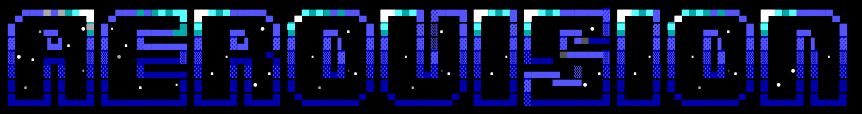
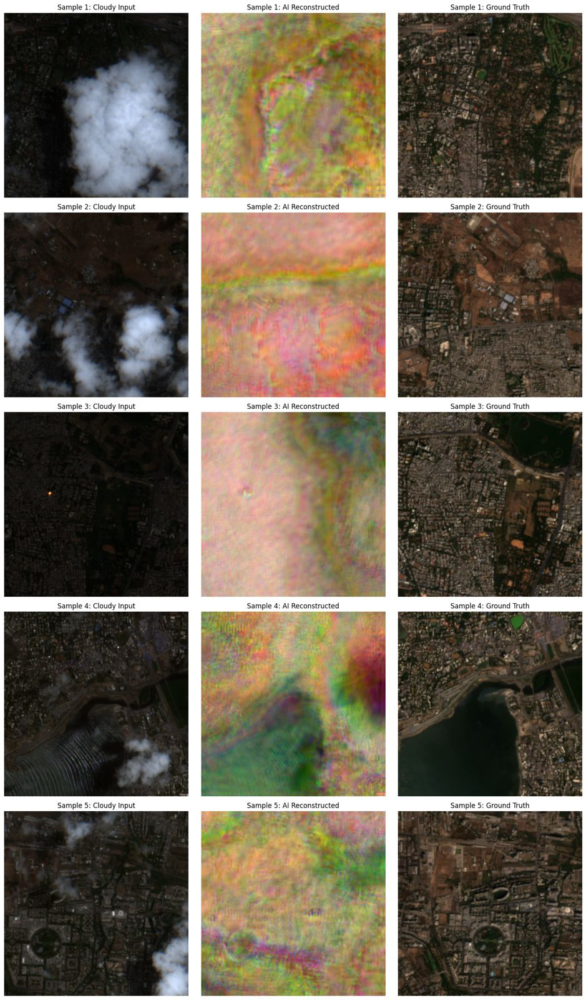

<p align="center">
  
</p>

<p align="center">
  
</p>

# AeroVision Cloud Synthesis Architecture

A production-grade, out-of-memory (OOM) safe machine learning pipeline engineered for the removal of atmospheric obstructions (cloud cover) from high-resolution satellite imagery. Engineered specifically for cross-sensor compatibility with ISRO LISS-IV payload data.

## Key Features

- **Cross-Sensor Domain Adaptation:** Trained on 4-band Sentinel-2 Harmonized data and performs synthetic transfer to 3-band LISS-IV inputs to generate seamless true-color approximations.
- **OOM-Safe Windowed Inference:** Capable of processing massively scaled geospatial GeoTIFF archives via an advanced buffered sliding-window iterator without RAM saturation.
- **Global Radiometric Normalization:** Implements sub-sampled 10-bit (2nd to 98th percentile) histogram stretching to ensure contiguous terrain brightness, entirely resolving patch-wise normalization artifacts.
- **Advanced Edge/L1 Loss Reconstruction:** U-Net encoder heavily penalized for structural dissonance to ensure synthetic pixels reflect true geospatial topology rather than blurred averages.

---

## Tech Stack

- **Language:** Python 3.10+
- **Deep Learning Framework:** PyTorch 2.0+ (Torchvision)
- **Geospatial Processing:** Rasterio, GDAL, EarthEngine-API
- **Data Pipeline:** H5py, NumPy
- **Visualization:** Matplotlib
- **Primary Model Architecture:** ResNet34-UNet (9-channel Modified Encoder)

---

## Prerequisites

To compile and execute this pipeline, the following hardware and software dependencies must be satisfied:

- **OS:** Linux (Ubuntu 22.04 LTS recommended) or macOS
- **GPU:** NVIDIA GPU with CUDA 11.8+ (Minimum 8GB VRAM for 256x256 batched inference) or Apple Silicon (MPS).
- **Storage:** 50GB+ high-speed NVMe SSD (for LISS-IV Raw GeoTIFF extraction and synthesis caching).
- **Dependencies:** `python3-dev`, `gdal-bin`, `libgdal-dev`

---

## Reproducing the Results (End-to-End Guide)

We designed AeroVision to be fully reproducible. By following this guide, you will execute the pipeline from raw satellite data to the finalized, clear-sky ISRO artifact.

### 1. Clone the Repository

```bash
git clone https://github.com/fs0cietyx/aero-vision.git
cd aero-vision
```

### 2. Install System Dependencies (Debian/Ubuntu)

```bash
sudo apt-get update
sudo apt-get install -y gdal-bin libgdal-dev python3-gdal
```

### 3. Install Python Dependencies

Create a virtual environment (recommended) and install the pip requirements:

```bash
python3 -m venv venv
source venv/bin/activate
pip install --upgrade pip
pip install -r requirements.txt
```

### 4. Authenticate Earth Engine

To generate fresh training data, authenticate your Google Earth Engine account:

```bash
earthengine authenticate
```

### 5. Execute the Pipeline

Run the modules in chronological order. Each script handles a discrete phase of the processing pipeline.

**Phase 1: Dataset Generation (Optional - if training from scratch)**
```bash
python 01_dataset_generation.py
```
*(This triggers asynchronous GEE export tasks. Monitor via your Google Earth Engine Console).*

**Phase 2: Model Training**
```bash
python 02_model_training.py
```
*(Will output `isro_model_epoch_X.pth` checkpoints based on your configured epochs).*

**Phase 3: Spatial Inference on LISS-IV Data**
Place your ISRO `.zip` file in your data directory and update `ZIP_PATH` in the script.
```bash
python 03_liss4_inference.py
```
*(Outputs the seamless synthetic TIFF: `ISRO_LISS4_CloudFree_Seamless.tif`)*

**Phase 4: Visual Validation**
```bash
python 04_visual_validation.py
```

### 6. Expected Final Output

Once `04_visual_validation.py` completes, you will have successfully generated a radiometric comparison identical to the showcase graphic at the top of this document.

---

## Architecture Overview

### Directory Structure

```text
├── .github/
│   ├── workflows/        # CI/CD linting bots
│   └── dependabot.yml    # Automated dependency updates
├── assets/               # Repository static assets (banner, results)
├── 01_dataset_generation.py  # GEE Export script (Sentinel-2 to Drive)
├── 02_model_training.py      # ResNet34-UNet PyTorch architecture and training loops
├── 03_liss4_inference.py     # OOM-Safe sliding window LISS-IV inference engine
├── 04_visual_validation.py   # Radiometric evaluation and PNG export tool
├── README.md             # Technical documentation
└── requirements.txt      # Pinned pip dependencies
```

### Core Execution Flow

1. **Ingestion:** Raw LISS-IV archives are recursively scanned for specific band imagery (Band 2, 3, 4).
2. **Patching:** `03_liss4_inference.py` chunks the massive array into `2048x2048` sliding windows, applying a `256px` safety padding to prevent edge bleeding.
3. **Synthesis:** The neural network infers the missing surface topology and outputs 3 synthetic pseudo-true-color channels.
4. **Stitching:** Inference outputs are seamlessly un-padded and flushed synchronously to the destination GeoTIFF to prevent memory overflow.

### Model Architecture (`02_model_training.py`)

- **Encoder:** Modified `torchvision.models.resnet34`. The initial convolutional layer is overridden to accept 9-channels (matching stacked multi-temporal data arrays) while retaining pre-trained `ResNet34_Weights.DEFAULT` across the remaining network hierarchy.
- **Decoder:** Bespoke upsampling U-Net utilizing `ConvTranspose2d`, ReLU activations, and strict batch normalization.
- **Loss Strategy:** Computes a composite tensor consisting of `nn.L1Loss()` (Mean Absolute Error for pixel-perfect brightness) and a Sobel-based Edge Detection Loss (to penalize blurred geographic reconstruction).

---

## Environmental Configuration

Path structures within the Python modules are heavily hardcoded toward Google Colab/Google Drive persistence for standard hackathon environments. **To run locally on Linux, modify the global variables at the top of the scripts.**

### Key Variables to Modify (`03_liss4_inference.py`)

| Variable | Description | Default |
| -------- | ----------- | ------- |
| `ZIP_PATH` | Absolute path to raw ISRO LISS-IV `.zip` payload | `/content/drive/MyDrive/R2F20JUL...zip` |
| `EXTRACT_DIR` | Directory to extract GeoTIFF bands | `/content/LISS4_RAW` |
| `WEIGHTS_PATH` | Path to PyTorch model weights `.pth` | `/content/drive/.../isro_model_epoch_24.pth` |
| `OUTPUT_TIF` | Destination path for the final synthesized map | `/content/drive/.../ISRO_LISS4_CloudFree_Seamless.tif` |

---

## Available Scripts

| Command | Description |
| ------- | ----------- |
| `python 01_dataset_generation.py` | Orchestrates Earth Engine to export Target and Cloudy Sentinel-2 temporal pairs. |
| `python 02_model_training.py` | Instantiates `ISROCloudDataset`, maps PyTorch `DataLoader`, and iterates the training loop. |
| `python 03_liss4_inference.py` | Ingests ISRO `.zip`, builds sliding window iterator, and executes PyTorch inference. |
| `python 04_visual_validation.py` | Applies a downsampled 10-bit histogram stretch across inference and target to generate `validation_result.png`. |

---

## Troubleshooting

### `MemoryError` or Hardware Colab Crash During Inference
**Symptom:** Script terminates abruptly or Python kernel restarts while running `03_liss4_inference.py`.
**Solution:** Reduce the spatial `STEP` variable in the script. The default `STEP = 2048` demands roughly 4-6GB of VRAM per pass. Decrease to `STEP = 1024` or `STEP = 512`. Ensure `PADDING` remains at `256` or `128` respectively.

### `rasterio.errors.RasterioIOError: No such file or directory`
**Symptom:** Script fails to find input bands during the `03_liss4_inference.py` extraction phase.
**Solution:** ISRO archives occasionally utilize heterogeneous naming conventions. Verify that the regex targeting `**/*BAND2*.tif` accurately reflects the unzipped nomenclature of your specific payload.

### Deep Blue Color Saturation on Inference
**Symptom:** The inferred image is completely blue.
**Solution:** This occurs due to un-normalized output tensors. Ensure you are running `04_visual_validation.py` which dynamically calculates the 98th percentile (`c_max`) and clips the array for appropriate visualization, or ensure your local GIS software (QGIS/ArcGIS) is instructed to stretch histograms to standard deviations.

---
*Developed under hackathon constraints. Not certified for critical aerospace deployment.*
